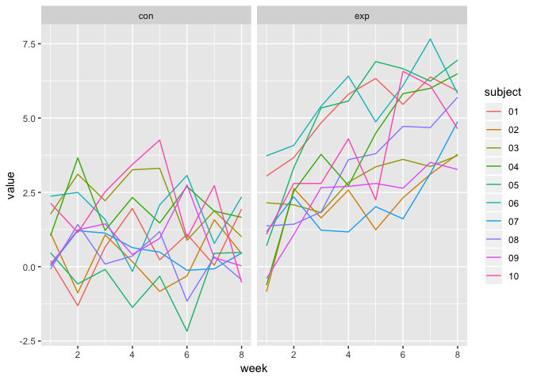
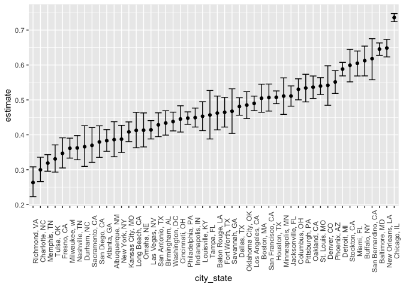

P8105\_hw5\_ja3314
================
Jaisal Amin
11/5/2018

### Problem 1

Reading in data from longitudinal study:

``` r
long_study_data = 
  tibble(file_name = list.files("./data/"),
         path = str_c("./data/", file_name)) %>% 
  mutate(data = map(path, read_csv)) %>% 
  unnest() %>% 
  select(-path) %>% 
  gather(key = week, value = value, week_1:week_8) %>% 
  separate(week, into = c("remove_1", "week"), sep = "_") %>% 
  separate(file_name, into = c("phase", "subject"), sep = "_") %>% 
  separate(subject, into = c("subject", "remove_2"), sep = "\\.") %>% 
  select(-remove_1, -remove_2) %>% 
  mutate(week = as.numeric(week))
```

Spaghetti plots comparing control arm with experimental:

``` r
long_study_data %>% 
  ggplot(aes(x = week, y = value, color = subject)) +
  geom_line(size = 0.5) +
  facet_grid(~phase)
```



Looking at the control and experimental groups, there appears to be an upward trend in the experimental group. The values for the control group stay steady within a certain range however the values for the experimental group show an overall increase.

### Problem 2

Reading in homicide data:

``` r
url = "https://raw.githubusercontent.com/washingtonpost/data-homicides/master/homicide-data.csv"
raw_data = read_csv(url) %>% 
  mutate(city_state = str_c(city, ",", " ", state)) %>% 
  mutate(victim_age = as.numeric(victim_age))
```

The raw Washington Post homicide data contains information on the victim including name, race, and age as well as information on the location, date, and status of the crime itself. The dataframe has information on 52179 homicides in 50 different cities.

Summarizing homicide totals:

``` r
status_totals = 
  raw_data %>% 
  group_by(city_state, disposition) %>% 
  count(disposition) %>% 
  spread(key = disposition, value = n) %>% 
  janitor::clean_names() %>% 
  mutate_all(funs(replace(., is.na(.), 0))) %>% 
  mutate(unsolved = closed_without_arrest + open_no_arrest) %>% 
  select(-closed_without_arrest, -open_no_arrest) %>% 
  rename(solved = closed_by_arrest) %>% 
  mutate(total = solved + unsolved)
```

Calculating proportion of unsolved homicides in Baltimore:

``` r
bmd = status_totals %>% 
  filter(city_state == "Baltimore, MD")
bmd_prop = prop.test(bmd$unsolved, bmd$total)

bmd_prop %>% 
  broom::tidy() %>% 
  select(estimate, conf.low, conf.high)
```

    ## # A tibble: 1 x 3
    ##   estimate conf.low conf.high
    ##      <dbl>    <dbl>     <dbl>
    ## 1    0.646    0.628     0.663

Calculating proportion of unsolved homicides for each city:

``` r
city_props = 
  status_totals %>% 
  mutate(prop = map2(unsolved, total, prop.test)) %>% 
  mutate(prop = map(prop, broom::tidy)) %>% 
  unnest() %>% 
  select(estimate, conf.low, conf.high) 
```

Plot with estimates and CIs for each city:

``` r
city_props %>% 
  filter(city_state != "Tulsa, AL") %>% ## Filtering out "Tulsa, AL" because that is not a real place
  ungroup %>% 
  mutate(city_state = fct_reorder(city_state, estimate)) %>% 
  ggplot(aes(x = city_state, y = estimate)) +
  geom_point() +
  geom_errorbar(aes(ymin = conf.low, ymax = conf.high)) +
  theme(axis.text.x = element_text(angle = 90))
```


